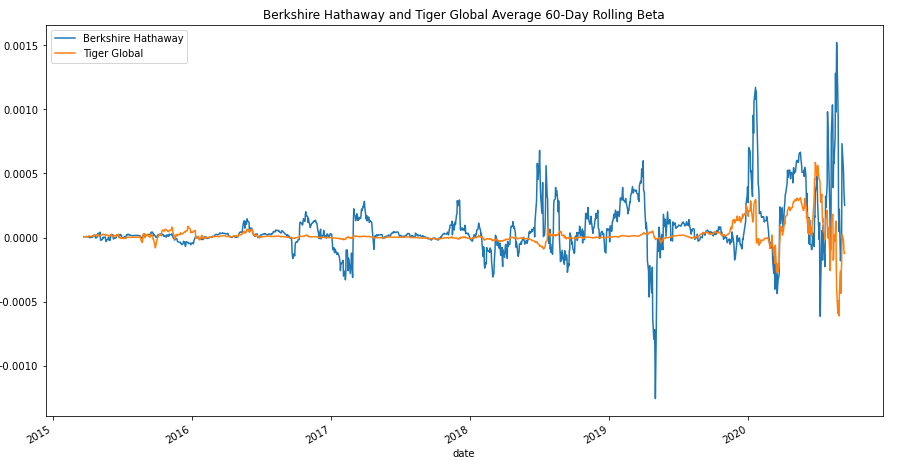

# Portfolio Risk Analysis Tool

<!-- TABLE OF CONTENTS -->

  
Table of Contents

  <ol>
    <li>
      <a href="#purpose">Purpose</a>
      <ul>
        <li><a href="#inputs">Inputs</a></li>
        <li><a href="#outputs">Outputs</a></li>
      </ul>
    </li>
    <li>
      <a href="#technologies">Technologies</a>
      <ul>
        <li><a href="#python">Python</a></li>
        <li><a href="#csv">CSV</a></li>
        <li><a href="#pandas">Pandas</a></li>
        <li><a href="#matplotlib">Matplotlib</a></li>
      </ul>
    </li>
    <li><a href="#version-release">Version Release</a></li>
    <li><a href="#how_to_run">How to run</a></li>
    <li><a href="#usage">Usage</a></li>
    <li><a href="#contributors">Contributors</a></li>
    <li><a href="#license">License</a></li>
        <ul>
        <li><a href="#permissions">Permissions</a></li>
        <li><a href="#disclaimer">Disclaimer</a></li>
        </ul>
    </li>
    <li><a href="#aknowledgements">Aknowledgements</a></li>

<!--Purpose -->
## Purpose
This tool can be used to analyze the risk of assets within a single DataFrame. The analysis includes risk-return metrics such as daily returns, etc. Statistical methods such as standard deviation, and mean are used to calculate portfolio performance, and other metrics to measure Risk such as Sharpe ratio and the beta values for each fund.

### Inputs
The application reads financial performance data from one file. Data is used to conduct futher analysis of the funds in comparision to the S&P 500, which is also included in the original Data Frame.

    whale_navs.csv

  
### Outputs
    Calculations of Percent change, Daily Returns, Cumulative Returns, etc. Visualizations used to understand fund Volatility, Risk, Risk-Return profiles for each fund, and comparisons between each or agains the S&P500. 
    

---
<!--Technologies -->
## Technologies
### Python:

    Phyton Version: **3.7.13**

### CSV:
[csv](https://docs.python.org/3/library/csv.html)

### Pandas
[Pandas](https://pandas.pydata.org/pandas-docs/stable/reference/api/pandas.DataFrame.html) 

### Matplotlib
[Matplotlib](https://matplotlib.org/stable/api/_as_gen/matplotlib.pyplot.plot.html)

---
<!--How to run -->
## How to run

1. Clone the repository on a folder that will easy to open
2. File was developed with Jypiter Notebook and Lab
3. Open the file with Jupiter through the Anaconda Navigator
4. Navigate open the folder where the files were cloned to
5. Open the file on JupterLab

---
<!--Version Release -->
## Version Release

### Version 1.0

---
<!--Usage -->
## Usage

### Portfolio performance data - sample:

### Visualization of cumulative return values for each fund over time - sample:

### Visualization of calculated Shape Ratios to analyze the risk-return profile for each fund - sample:

### Visualization comparing each fund based on 60 day rolling Beta- sample:

---
<!--Contributors -->
## Contributors

Jeremy Vargas

    Managing Director
    Resonant Solutions LLC
    email:    jeremyvargas@resonantsolutions.org
    linkedin: https://www.linkedin.com/in/jeremyvargas/

UW FinTech Bootcamp
- Startup code provided by institution

---
<!--License -->
## License
Portfolio Risk Analysis tool is available under an MIT License.

Copyright (c) 2022 - Resonant Solutions, LLC

### Permissions
Permission is hereby granted, free of charge, to any person obtaining a copy of this software and associated documentation files (the “Software”), to deal in the Software without restriction, including without limitation the rights to use, copy, modify, merge, publish, distribute, sublicense, and/or sell copies of the Software, and to permit persons to whom the Software is furnished to do so, subject to the following conditions:

The above copyright notice and this permission notice shall be included in all copies or substantial portions of the Software.
### Disclaimer
The Software is provided “as is”, without warranty of any kind, express or implied, including but not limited to the warranties of merchantability, fitness for a particular purpose and noninfringement. In no event shall the authors or copyright holders be liable for any claim, damages or other liability, whether in an action of contract, tort or otherwise, arising from, out of or in connection with the software or the use or other dealings in the Software.

---
<!--Aknowledgements -->
## Aknowledgements
* [Markdown Guide](https://www.markdownguide.org/basic-syntax/#reference-style-links)

<!-- MARKDOWN LINKS & IMAGES -->
<!-- https://www.markdownguide.org/basic-syntax/#reference-style-links -->